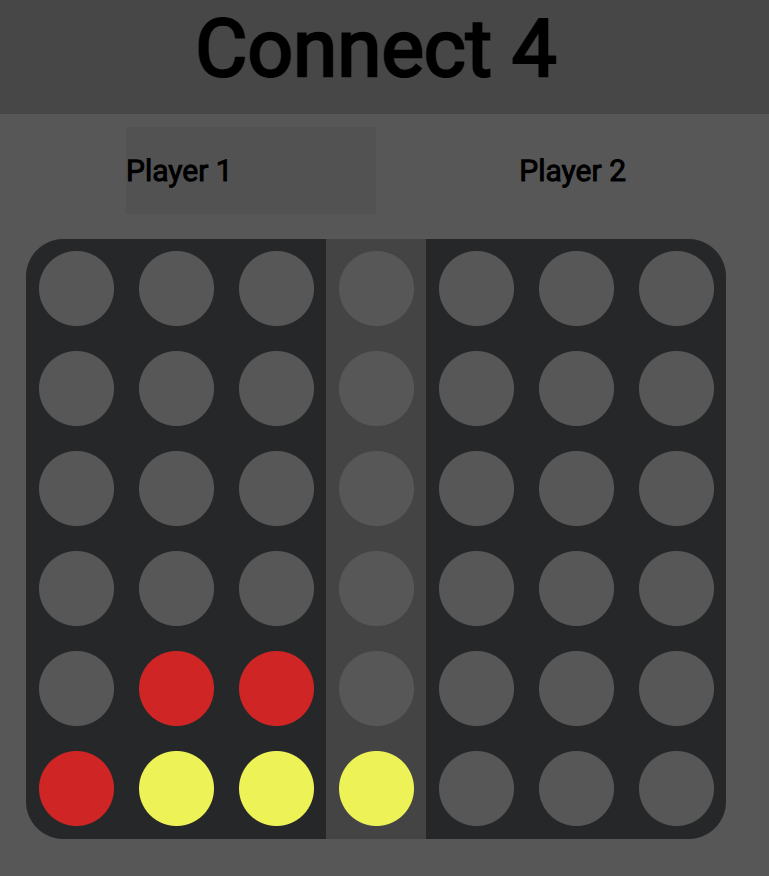

# Real-Time Multiplayer Connect 4

A real-time multiplayer Connect 4 game built with **Python (FastAPI)**, **WebSockets**, and **JavaScript**. It showcases skills in asynchronous I/O, concurrency, state management, and real-time frontend/backend synchronization.

### 🚀 Features
- Real-time two-player gameplay (in separate browser tabs on the same device)
- WebSocket-based communication between players
- Game logic implemented using Python OOP
- Interactive Connect 4 board with responsive UI
- Tracks player turns and win/draw conditions

### ⚙️ Technologies Used
- Python + FastAPI
- WebSockets
- HTML/CSS/JavaScript

### 🔧 How to Run
1. Clone the repository.
2. Run: `uvicorn main:app --reload`
3. Open: `http://localhost:8000` in two browser tabs.

### 🖼️ Screenshot
