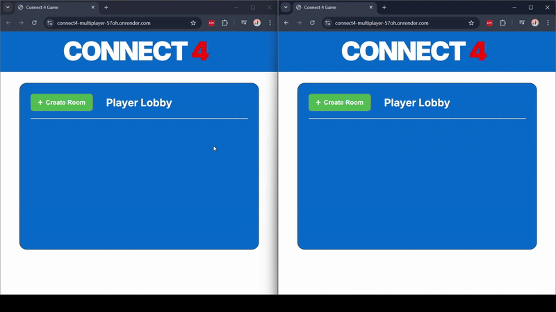

# Real-Time Multiplayer Connect 4

🔗 **Live Demo:** [View here](https://connect4-multiplayer-57oh.onrender.com)

An online, real-time multiplayer Connect 4 game built with **Python (FastAPI)**, **WebSockets**, and **JavaScript**. It showcases skills in asynchronous I/O, concurrency, state management, and seamless frontend/backend synchronization. 

### 🚀 Features
- **Online multiplayer** - Play with anyone, anywhere in real-time
- **Real-time gameplay** - Instant moves and updates
- **Room-based system** - Create or join game rooms
- **WebSocket communication** - Low-latency player synchronization
- **Interactive board** - Responsive UI with visual feedback
- **Win detection** - Automatic game state tracking

### 🎮 How to Play Online
1. **Visit the live demo** above
2. **Create a room** or join an existing one
4. **Start playing** in real-time!

### ⚙️ Technologies Used
- Python + FastAPI
- WebSockets
- HTML/CSS/JavaScript

### 📦 Requirements
- Python 3.10+
- FastAPI
- Uvicorn

### 🔧 How to Run
1. Clone the repository.
2. Run: `uvicorn main:app --reload`
3. Open: `http://localhost:8000` in two browser tabs.

### Gameplay Demo

